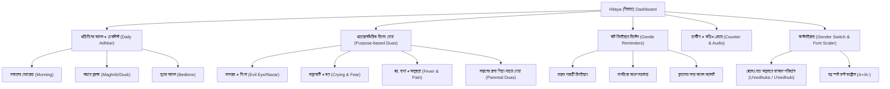

# 🌙 Hifaya (হিফায়া) — Comprehensive Plan & Architecture
### *ইসলামিক শিশু হেফাজত, প্রতিদিনের দোয়া, রুটিন ও রিমাইন্ডার অ্যাপ*

---

## ১. ভূমিকা ও অ্যাপ পরিচিতি (App Overview & Vision)

**Hifaya (হিফায়া)** হলো শিশুদের সুরক্ষা (Protection), সুস্থতা, প্রশান্তি এবং পিতা-মাতার প্রতিদিনের আমলের জন্য একটি আধুনিক, স্নিগ্ধ ও হৃদয়গ্রাহী ইসলামিক ওয়েব ও মোবাইল অ্যাপ্লিকেশন।

অনেক পিতা-মাতা শিশুর জন্মের পর বদনজর (Evil Eye / حسد), ভয় পাওয়া, অনিদ্রা, অসুস্থতা বা কান্নাকাটির সময় কোন দোয়া পড়তে হবে, কীভাবে ফু দিতে হবে এবং দৈনন্দিন কী কী আমল করা সুন্নত—তা নিয়ে চিন্তিত থাকেন। **হিফায়া** অ্যাপটি সহীহ হাদিস ও কোরআনের আলোকে প্রতিটি দোয়ার **বিশুদ্ধ আরবি (হরকতসহ)**, **সহজ বাংলা উচ্চারণ (Transliteration)**, **বিশুদ্ধ বাংলা অর্থ** এবং **আমলের সঠিক নিয়ম** একসাথে উপস্থাপন করবে।

---

## ২. অ্যাপের প্রধান বৈশিষ্ট্যসমূহ (Key Features)



1. **ড্যাশবোর্ড (Dashboard)**:
   - আজকের দিনের রুটিন প্রগ্রেস (সকাল, সন্ধ্যা, রাত)।
   - কুইক অ্যাকশন কার্ডস: "বদনজর কাটানো", "শিশু বেশি কাঁদলে", "জ্বর বা অসুস্থতায়", "ঘুমের দোয়া"।
   - শান্ত ও মায়াবী ভিজ্যুয়াল আবহ।

2. **হরকতসহ বড় আরবি, সহজ বাংলা উচ্চারণ ও অর্থ**:
   - চোখের প্রশান্তিদায়ক বড় ফন্ট (Scalable Readable Fonts)।
   - প্রতিটি শব্দের সঠিক উচ্চারণ নিশ্চিত করতে বাংলা ধ্বনিনিরূপক উচ্চারণ।
   - প্রাঞ্জল ও অর্থপূর্ণ বাংলা অনুবাদ।

3. **স্মার্ট প্রোফাইল ও সর্বনাম পরিবর্তন (Dynamic Pronoun Switcher)**:
   - শিশুর লিঙ্গ নির্বাচন করা যাবে: ছেলে (Baby Boy), মেয়ে (Baby Girl), বা একাধিক সন্তান (Twins/Multiple)।
   - নির্বাচিত লিঙ্গ অনুযায়ী হাদিসের দোয়া স্বয়ংক্রিয়ভাবে পরিবর্তিত হবে (যেমন: ছেলে হলে `أُعِيذُكَ` [উ‘ঈযুকা], মেয়ে হলে `أُعِيذُكِ` [উ‘ঈযুকি], একাধিক হলে `أُعِيذُكُمَا` [উ‘ঈযুকুম্বা])।

4. **স্মার্ট রিমাইন্ডার (Notification & Reminder System)**:
   - সকালের হেফাজত রিমাইন্ডার (ফজরের পর)।
   - সন্ধ্যার বিশেষ সতর্কতা (হাদিস অনুযায়ী সূর্যাস্তের সময় শিশুদের ঘরের ভেতরে রাখা ও দোয়া পড়ার রিমাইন্ডার)।
   - ঘুমের আমল রিমাইন্ডার।

5. **ইন্টারেক্টিভ ডিজিটাল কাউন্টার (Digital Tasbih)**:
   - ৩ বার, ৭ বার বা ৩৩ বার পড়ার দোয়ার জন্য স্মুথ হ্যাপটিক/ট্যাপ কাউন্টার।

6. **অডিও তিলাওয়াত ও রুকইয়াহ (Soothing Audio Playback)**:
   - শিশুর ঘুমের জন্য মিষ্টি ও প্রশান্তিময় কোরআন তিলাওয়াত ও রুকইয়াহ অডিও।

7. **অফলাইন সাপোর্ট (PWA Ready)**:
   - ইন্টারনেট ছাড়াও সম্পূর্ণ দোয়ার তালিকা, তসবীহ ও রুটিন কাজ করবে।

---

## ৩. সম্পূর্ণ দোয়ার ডাটাবেজ (Complete Dua Collection with Arabic, Bangla Pronunciation & Meaning)

### ক্যাটাগরি ১: প্রতিদিনের নিত্যদিনের হেফাজত (Daily Essential Protection)

#### ১.১. শিশুর সুরক্ষায় রাসুলুল্লাহ (ﷺ)-এর সবচেয়ে প্রধান দোয়া (নবীজীর আমল)
*দলিল: সহীহ বুখারী: ৩৩৭১ (নবীজী ﷺ হাসান ও হুসাইন (রা.)-এর সুরক্ষার জন্য এই দোয়া পড়তেন)*

| ক্ষেত্র | আরবি পাঠ (উচ্চারণসহ) |
| :--- | :--- |
| **আরবি (ছেলে শিশুর জন্য)** | أُعِيذُكَ بِكَلِمَاتِ اللَّهِ التَّامَّةِ، مِنْ كُلِّ شَيْطَانٍ وَهَامَّةٍ، وَمِنْ كُلِّ عَيْنٍ لَامَّةٍ |
| **বাংলা উচ্চারণ (ছেলে)** | **"উ‘ঈযুকা বিকালিমা-তিল্লা-হিত তা-ম্মাহ, মিন কুল্লি শায়ত্বা-নিন ওয়া হা-ম্মাহ, ওয়া মিন কুল্লি ‘আইনিন লা-ম্মাহ।"** |
| **আরবি (মেয়ে শিশুর জন্য)** | أُعِيذُكِ بِكَلِمَاتِ اللَّهِ التَّامَّةِ، مِنْ كُلِّ شَيْطَانٍ وَهَامَّةٍ، وَمِنْ كُلِّ عَيْنٍ لَامَّةٍ |
| **বাংলা উচ্চারণ (মেয়ে)** | **"উ‘ঈযুকি বিকালিমা-তিল্লা-হিত তা-ম্মাহ, মিন কুল্লি শায়ত্বা-নিন ওয়া হা-ম্মাহ, ওয়া মিন কুল্লি ‘আইনিন লা-ম্মাহ।"** |
| **আরবি (একাধিক শিশু)** | أُعِيذُكُمَا بِكَلِمَاتِ اللَّهِ التَّامَّةِ، مِنْ كُلِّ شَيْطَانٍ وَهَامَّةٍ، وَمِنْ كُلِّ عَيْنٍ لَامَّةٍ |
| **বাংলা উচ্চারণ (একাধিক)** | **"উ‘ঈযুকুম্বা বিকালিমা-তিল্লা-হিত তা-ম্মাহ, মিন কুল্লি শায়ত্বা-নিন ওয়া হা-ম্মাহ, ওয়া মিন কুল্লি ‘আইনিন লা-ম্মাহ।"** |
| **বাংলা অর্থ** | "আমি আল্লাহর পরিপূর্ণ বাক্যসমূহের আশ্রয়ে তোমায় সমর্পণ করছি—সকল শয়তান ও বিষাক্ত কীটপতঙ্গ হতে এবং সকল ক্ষতিকর বদনজর হতে।" |
| **আমলের নিয়ম** | প্রতিদিন সকাল, সন্ধ্যা এবং বাইরে বের হওয়ার আগে শিশুর মাথায় হাত রেখে একবার বা তিনবার পড়ে গায়ে ফুঁ দেবেন। |

---

#### ১.২. তিন কুল (সূরা আল-ইখলাস, সূরা আল-ফালাক, সূরা আন-নাস)
*দলিল: আবু দাউদ: ৫০৮২, তিরমিযী: ৩৫৭৫ (সকাল-সন্ধ্যায় ৩ বার পাঠ করলে সকল অনিষ্ট থেকে হেফাজতের জন্য যথেষ্ট)*

1. **সূরা আল-ইখলাস**:
   - **আরবি**: قُلْ هُوَ اللَّهُ أَحَدٌ ۝ اللَّهُ الصَّمَدُ ۝ لَمْ يَلِدْ وَلَمْ يُولَدْ ۝ وَلَمْ يَكُن لَّهُ كُفُوًا أَحَدٌ
   - **বাংলা উচ্চারণ**: *কুল হুওয়াল্লা-হু আহাদ। আল্লা-হুস সামাদ। লাম ইয়ালিদ ওয়া লাম ইয়ূলাদ। ওয়া লাম ইয়াকুল্লাহু কুফুওয়ান আহাদ।*
   - **বাংলা অর্থ**: "বলুন, তিনিই আল্লাহ, একক। আল্লাহ অমুখাপেক্ষী। তিনি কাউকে জন্ম দেননি এবং কেউ তাকে জন্ম দেয়নি। এবং তাঁর সমতুল্য কেউই নেই।"

2. **সূরা আল-ফালাক (অনিষ্ট ও হিংসুক থেকে বাঁচার দোয়া)**:
   - **আরবি**: قُلْ أَعُوذُ بِرَبِّ الْفَلَقِ ۝ مِن شَرِّ مَا خَلَقَ ۝ وَمِن شَرِّ غَاسِقٍ إِذَا وَقَبَ ۝ وَمِن شَرِّ النَّفَّاثَاتِ فِي الْعُقَدِ ۝ وَمِن شَرِّ حَاسِدٍ إِذَا حَسَدَ
   - **বাংলা উচ্চারণ**: *কুল আ‘ঊযু বিরব্বিল ফালাক। মিন শাররি মা- খালাক। ওয়া মিন শাররি গা-সিকিন ইযা- ওয়াকাব। ওয়া মিন শাররিন নাফ্ফা-সা-তি ফিল ‘উকাদ। ওয়া মিন শাররি হা-সিদিন ইযা- হাসাদ।*
   - **বাংলা অর্থ**: "বলুন, আমি আশ্রয় প্রার্থনা করছি ভোরের প্রতিপালকের, তিনি যা সৃষ্টি করেছেন তার অনিষ্ট হতে; অন্ধকার রাতের অনিষ্ট হতে যখন তা সমাগত হয়; গিরায় ফুৎকারকারিণীদের অনিষ্ট হতে; এবং হিংসুকের অনিষ্ট হতে যখন সে হিংসা করে।"

3. **সূরা আন-নাস (শয়তানের কুমন্ত্রণা ও ক্ষতি থেকে বাঁচার দোয়া)**:
   - **আরবি**: قُلْ أَعُوذُ بِرَبِّ النَّاسِ ۝ مَلِكِ النَّاسِ ۝ إِلَٰهِ النَّاسِ ۝ مِن شَرِّ الْوَسْوَاسِ الْخَنَّاسِ ۝ الَّذِي يُوَسْوِسُ فِي صُدُورِ النَّاسِ ۝ مِنَ الْجِنَّةِ وَالنَّاسِ
   - **বাংলা উচ্চারণ**: *কুল আ‘ঊযু বিরব্বিন না-স। মালিকিন না-স। ইলা-হিন না-স। মিন শাররিল ওয়াসওয়া-সিল খান্না-স। আল্লাযী ইউওয়াসউইসু ফী সুদূরিন না-স। মিনাল জিন্নাতি ওয়ান না-স।*
   - **বাংলা অর্থ**: "বলুন, আমি আশ্রয় প্রার্থনা করছি মানুষের প্রতিপালকের, মানুষের অধিপতির, মানুষের উপাস্যের; আত্মগোপনকারী কুমন্ত্রণাদাতার অনিষ্ট হতে, যে মানুষের অন্তরে কুমন্ত্রণা দেয়, জিন ও মানুষের মধ্য হতে।"

* **আমলের নিয়ম**: দুই হাত একত্রিত করে সূরা ৩টি ৩ বার পাঠ করে ফুঁ দিয়ে শিশুর মাথা থেকে পা পর্যন্ত সারা শরীরে হাত বুলিয়ে দিন।

---

#### ১.৩. আয়াতুল কুরসী (সর্বশ্রেষ্ঠ সুরক্ষার আয়াত)
*দলিল: সহীহ বুখারী: ২৩১১ (রাতে পাঠ করলে সকাল পর্যন্ত আল্লাহর পক্ষ থেকে একজন রক্ষক নিযুক্ত থাকে এবং শয়তান কাছে আসতে পারে না)*

- **আরবি**:
  اللَّهُ لَا إِلَٰهَ إِلَّا هُوَ الْحَيُّ الْقَيُّومُ ۚ لَا تَأْخُذُهُ سِنَةٌ وَلَا نَوْمٌ ۚ لَّهُ مَا فِي السَّمَاوَاتِ وَمَا فِي الْأَرْضِ ۗ مَن ذَا الَّذِي يَشْفَعُ عِندَهُ إِلَّا بِإِذْنِهِ ۚ يَعْلَمُ مَا بَيْنَ أَيْدِيهِمْ وَمَا خَلْفَهُمْ ۖ وَلَا يُحِيطُونَ بِشَيْءٍ مِّنْ عِلْمِهِ إِلَّا بِمَا شَاءَ ۚ وَسِعَ كُرْسِيُّهُ السَّمَاوَاتِ وَالْأَرْضَ ۖ وَلَا يَئُودُهُ حِفْظُهُمَا ۚ وَهُوَ الْعَلِيُّ الْعَظِيمُ
- **বাংলা উচ্চারণ**:
  *আল্লা-হু লা- ইলা-হা ইল্লা- হুওয়াল হাইয়্যুল ক্বাইয়্যূম। লা- তা’খুযুহূ সিনাতুঁও ওয়ালা- নাউম। লাহূ মা- ফিস্ সামা-ওয়া-তি ওয়ামা- ফিল আরদ্ব। মান যাল্লাযী ইয়্যাশফা‘উ ‘ইন্দাহূ ইল্লা- বিইযনিহ। ইয়া‘লামু মা- বাইনা আইদীহিম ওয়ামা- খালফাহুম, ওয়ালা- ইউহীতূনা বিশাইয়িম মিন ‘ইলমিহী ইল্লা- বিমা- শা-আ। ওয়াসি‘আ কুরসিইয়্যুহুস্ সামা-ওয়া-তি ওয়াল আরদ্ব, ওয়ালা- ইয়াউদুহূ হিফযুহুমা- ওয়া হুওয়াল ‘আলিয়্যুল ‘আযীম।*
- **বাংলা অর্থ**:
  "আল্লাহ ছাড়া অন্য কোনো সত্য উপাস্য নেই, তিনি চিরঞ্জীব, সবকিছুর ধারক। তন্দ্রা বা নিদ্রা তাঁকে স্পর্শ করে না। আকাশমণ্ডলী ও পৃথিবীতে যা কিছু আছে সবই তাঁর। কে আছে যে তাঁর অনুমতি ছাড়া তাঁর কাছে সুপারিশ করবে? তাদের সম্মুখে ও পেছনে যা কিছু আছে তা তিনি অবগত। আর তারা তাঁর জ্ঞানের কিছুই আয়ত্ত করতে পারে না, কেবল যতটুকু তিনি ইচ্ছা করেন। তাঁর কুরসী সমস্ত আসমান ও জমিন পরিবেষ্টন করে আছে, আর এ দুটির রক্ষণাবেক্ষণ তাঁকে বিন্দুমাত্র ক্লান্ত করে না। তিনি পরম উচ্চ, সর্বশ্রেষ্ঠ।"

---

#### ১.৪. সকাল-সন্ধ্যার হেফাজতের দোয়া (বিপদ ও বিষাক্ত ক্ষতি থেকে রক্ষা)
*দলিল: তিরমিযী: ৩৩৮৮, আবু দাউদ: ৫০৮৮ (সকাল ও সন্ধ্যায় ৩ বার পড়লে আসমান-জমিনের কোনো ক্ষতি স্পর্শ করবে না)*

- **আরবি**:
  بِسْمِ اللَّهِ الَّذِي لَا يَضُرُّ مَعَ اسْمِهِ شَيْءٌ فِي الْأَرْضِ وَلَا فِي السَّمَاءِ وَهُوَ السَّمِيعُ الْعَلِيمُ
- **বাংলা উচ্চারণ**:
  **"বিসমিল্লা-হিল্লাযী লা- ইয়াদ্বুররু মা‘আসমিহী শাইউন ফিল আরদ্বি ওয়ালা- ফিস্ সামা-ই, ওয়া হুওয়াস সামী‘উল ‘আলীম।"**
- **বাংলা অর্থ**:
  "আল্লাহর নামে (আশ্রয় নিচ্ছি), যাঁর নামের সাথে আসমান ও জমিনের কোনো বস্তুই কোনো ক্ষতি সাধন করতে পারে না; আর তিনি সর্বশ্রোতা, সর্বজ্ঞাতা।"
- **আমলের নিয়ম**: প্রতিদিন সকালে ও সন্ধ্যায় ৩ বার পড়ে ফুঁ দিন।

---

#### ১.৫. সৃষ্টির সকল অকল্যাণ থেকে সুরক্ষার দোয়া
*দলিল: সহীহ মুসলিম: ২৭০৮*

- **আরবি**:
  أَعُوذُ بِكَلِمَاتِ اللَّهِ التَّامَّاتِ مِنْ شَرِّ مَا خَلَقَ
- **বাংলা উচ্চারণ**:
  **"আ‘ঊযু বিকালিমা-তিল্লা-হিত তা-ম্মা-তি মিন শাররি মা- খালাক্ব।"**
- **বাংলা অর্থ**:
  "আমি আল্লাহর পরিপূর্ণ বাক্যসমূহের আশ্রয়ে পানাহ চাই তিনি যা সৃষ্টি করেছেন তার সকল অনিষ্ট হতে।"
- **আমলের নিয়ম**: সন্ধ্যায় ৩ বার পাঠ।

---

### ক্যাটাগরি ২: প্রয়োজনভিত্তিক বিশেষ দোয়া (Duas for Specific Situations)

#### ২.১. বদনজর (Evil Eye / আল-আইন) থেকে বাঁচার দোয়া ও রুকইয়াহ
*দলিল: সহীহ মুসলিম: ২১৮৬ (জিবরাঈল আ. রাসুলুল্লাহ ﷺ-কে এই দোয়া দিয়ে ঝাড়ফুঁক করেছিলেন)*

- **আরবি (ছেলে শিশুর জন্য)**:
  بِسْمِ اللَّهِ أَرْقِيكَ، مِنْ كُلِّ شَيْءٍ يُؤْذِيكَ، مِنْ شَرِّ كُلِّ نَفْسٍ أَوْ عَيْنِ حَاسِدٍ، اللَّهُ يَشْفِيكَ، بِسْمِ اللَّهِ أَرْقِيكَ
- **বাংলা উচ্চারণ (ছেলে)**:
  **"বিসমিল্লা-হি আরক্বীকা, মিন কুল্লি শাইয়িন ইউ’যীকা, মিন শাররি কুল্লি নাফসিন আও ‘আইনি হা-সিদিন, আল্লা-হু ইয়াশফীকা, বিসমিল্লা-হি আরক্বীকা।"**
- **আরবি (মেয়ে শিশুর জন্য)**:
  بِسْمِ اللَّهِ أَرْقِيكِ، مِنْ كُلِّ شَيْءٍ يُؤْذِيكِ، مِنْ شَرِّ كُلِّ نَفْسٍ أَوْ عَيْنِ حَاسِدٍ، اللَّهُ يَشْفِيكِ، بِسْمِ اللَّهِ أَرْقِيكِ
- **বাংলা উচ্চারণ (মেয়ে)**:
  **"বিসমিল্লা-হি আরক্বীকি, মিন কুল্লি শাইয়িন ইউ’যীকি, মিন শাররি কুল্লি নাফসিন আও ‘আইনি হা-সিদিন, আল্লা-হু ইয়াশফীকি, বিসমিল্লা-হি আরক্বীকি।"**
- **বাংলা অর্থ**:
  "আল্লাহর নামে আমি তোমাকে ফুঁ দিচ্ছি (রুকইয়াহ করছি), এমন সব জিনিস থেকে যা তোমাকে কষ্ট দেয়; প্রতিটি প্রাণের অনিষ্ট অথবা হিংসুকের বদনজর থেকে। আল্লাহ তোমাকে আরোগ্য দান করুন। আল্লাহর নামে আমি তোমাকে ঝাড়ফুঁক করছি।"
- **অন্যের দৃষ্টি থেকে বাঁচাতে মুখে বলার দোয়া**:
  *مَا شَاءَ اللَّهُ لَا قُوَّةَ إِلَّا بِاللَّهِ، اللَّهُمَّ بَارِكْ فِيهِ / فِيهَا*
  ("মা শা-আল্লাহু লা- কুওয়াতা ইল্লা- বিল্লাহ, আল্লাহুম্মা বা-রিক ফীহি/ফীহা" - মাশাআল্লাহ, আল্লাহ এতে বরকত দান করুন)।

---

#### ২.২. শিশু হঠাৎ বেশি কাঁদলে, ভয় পেলে বা ঘুমাতে না চাইলে
*দলিল: তিরমিযী: ৩৫২৮ (ঘুমের মধ্যে ভয় পাওয়া ও অস্থিরতার দোয়া)*

- **আরবি**:
  أَعُوذُ بِكَلِمَاتِ اللَّهِ التَّامَّاتِ مِنْ غَضَبِهِ وَعِقَابِهِ وَشَرِّ عِبَادِهِ، وَمِنْ هَمَزَاتِ الشَّيَاطِينِ وَأَنْ يَحْضُرُونِ
- **বাংলা উচ্চারণ**:
  **"আ‘ঊযু বিকালিমা-তিল্লা-হিত তা-ম্মা-তি মিন গাদ্বাবিহী ওয়া ‘ইক্বা-বিহী ওয়া শাররি ‘ইবা-দিহী, ওয়া মিন হামাযা-তিশ শায়া-ত্বীনি ওয়া আঁই ইয়াহদুরূন।"**
- **বাংলা অর্থ**:
  "আমি আল্লাহর পরিপূর্ণ বাণীসমূহের অসীলায় আশ্রয় প্রার্থনা করছি—তাঁর ক্রোধ হতে, তাঁর শাস্তি হতে, তাঁর বান্দাদের অনিষ্ট হতে এবং শয়তানদের প্ররোচনা ও আমার নিকট তাদের উপস্থিতি হতে।"
- **আমলের নিয়ম**: শিশুর বুকে আস্তে হাত বুলিয়ে দোয়াটি পাঠ করুন এবং সূরা ফাতিহা পড়ে ফুঁ দিন।

---

#### ২.৩. শিশু অসুস্থ হলে, জ্বর বা কোনো অঙ্গে ব্যথা পেলে
*দলিল: সহীহ বুখারী: ৫৭৫০, সহীহ মুসলিম: ২১৯১*

- **১ম আমল (ব্যথার স্থানে হাত রেখে)**:
  - প্রথমে ৩ বার বলুন: **بِسْمِ اللَّهِ** (*বিসমিল্লাহ*)।
  - এরপর ৭ বার এই দোয়াটি পড়ুন:
    - **আরবি**: أَعُوذُ بِاللَّهِ وَقُدْرَتِهِ مِنْ شَرِّ مَا أَجِدُ وَأُحَاذِرُ
    - **বাংলা উচ্চারণ**: **"আ‘ঊযু বিল্লা-হি ওয়া কুদরাতিহী মিন শাররি মা- আজিদু ওয়া উহাযির।"**
    - **বাংলা অর্থ**: "আমি আল্লাহর এবং তাঁর অসীম কুদরতের আশ্রয় চাচ্ছি সেই অনিষ্ট হতে যা আমি পাচ্ছি এবং যার আশঙ্কা করছি।"
- **২য় আমল (রোগ মুক্তির দোয়া)**:
  - **আরবি**:
    اللَّهُمَّ رَبَّ النَّاسِ، أَذْهِبِ الْبَأْسَ، وَاشْفِ أَنْتَ الشَّافِي، لَا شِفَاءَ إِلَّا شِفَاؤُكَ، شِفَاءً لَا يُغَادِرُ سَقَمًا
  - **বাংলা উচ্চারণ**:
    **"আল্লাহুম্মা রব্বান-না-স, আযহিবিল বা’স, ওয়াশফি আনতাশ-শা-ফী, লা- শিফা-আ ইল্লা- শিফা-উক, শিফা-আন লা- ইউগা-দিরু সাক্বামা-।"**
  - **বাংলা অর্থ**:
    "হে আল্লাহ! মানবজাতির প্রতিপালক! আপনি এ রোগ দূর করে দিন এবং আরোগ্য দান করুন, আপনিই একমাত্র আরোগ্যকারী। আপনার নিরাময় ছাড়া কোনো নিরাময় নেই; এমন নিরাময় যা কোনো রোগ অবশিষ্ট রাখে না।"

---

#### ২.৪. ঘুমানোর সময় ও ঘুম থেকে ওঠার দোয়া
*দলিল: সহীহ বুখারী: ৬৩১২, ৬৩১৪*

1. **ঘুমানোর সময় দোয়া**:
   - **আরবি**: بِاسْمِكَ اللَّهُمَّ أَمُوتُ وَأَحْيَا
   - **বাংলা উচ্চারণ**: **"বিসমিকা আল্লাহুম্মা আমূতু ওয়া আহ্ইয়া-।"**
   - **বাংলা অর্থ**: "হে আল্লাহ! আপনার নামেই আমি মৃত্যুবরণ করি (ঘুমাই) এবং আপনার নামেই জীবিত (জাগ্রত) হই।"

2. **ঘুম থেকে ওঠার পর দোয়া**:
   - **আরবি**: الْحَمْدُ لِلَّهِ الَّذِي أَحْيَانَا بَعْدَ مَا أَمَاتَنَا وَإِلَيْهِ النُّشُورُ
   - **বাংলা উচ্চারণ**: **"আলহামদু লিল্লা-হিল্লাযী আহ্ইয়া-না- বা‘দা মা- আমা-তানা- ওয়া ইলাইহিন্ নুশূর।"**
   - **বাংলা অর্থ**: "সকল প্রশংসা আল্লাহর জন্য, যিনি মৃত্যুর (ঘুমের) পর আমাদের পুনরায় জীবন দান করলেন এবং তাঁর দিকেই সবার পুনরুত্থান।"

---

### ক্যাটাগরি ৩: সন্তানের নেক হায়াত, চরিত্র ও ভবিষ্যতের জন্য কোরআনী দোয়া (Parental Blessings)

#### ৩.১. চোখ জুড়ানো নেককার সন্তানের দোয়া
*দলিল: সূরা আল-ফুরকান: ৭৪*

- **আরবি**:
  رَبَّنَا هَبْ لَنَا مِنْ أَزْوَاجِنَا وَذُرِّيَّاتِنَا قُرَّةَ أَعْيُنٍ وَاجْعَلْنَا لِلْمُتَّقِينَ إِمَامًا
- **বাংলা উচ্চারণ**:
  **"রব্বানা- হাব লানা- মিন আযওয়া-জিনা- ওয়া যুররিইয়্যা-তিনা- কুররাতা আ‘ইয়ুনিঁও ওয়াজ‘আলনা- লিল মুত্তাকীনা ইমা-মা-।"**
- **বাংলা অর্থ**:
  "হে আমাদের প্রতিপালক! আমাদের স্ত্রী ও সন্তান-সন্ততির পক্ষ থেকে আমাদের চোখের শীতলতা দান করুন এবং আমাদেরকে মুত্তাকীদের নেতা বানান।"

---

#### ৩.২. পবিত্র ও কল্যাণময় সন্তানের জন্য হযরত জাকারিয়া (আ.)-এর দোয়া
*দলিল: সূরা আলে ইমরান: ৩৮*

- **আরবি**:
  رَبِّ هَبْ لِي مِن لَّدُنكَ ذُرِّيَّةً طَيِّبَةً ۖ إِنَّكَ سَمِيعُ الدُّعَاءِ
- **বাংলা উচ্চারণ**:
  **"রব্বি হাব লী মিল্লাদুন্কা যুররিইয়্যাতান ত্বাইয়্যিবাহ্, ইন্নাকা সামী‘উদ দু‘আ-।"**
- **বাংলা অর্থ**:
  "হে আমার প্রতিপালক! আপনার পক্ষ থেকে আমাকে পবিত্র সন্তান দান করুন। নিশ্চয় আপনি প্রার্থনা শ্রবণকারী।"

---

#### ৩.৩. সন্তানকে নামাজী বানানোর জন্য হযরত ইব্রাহীম (আ.)-এর দোয়া
*দলিল: সূরা ইব্রাহীম: ৪০*

- **আরবি**:
  رَبِّ اجْعَلْنِي مُقِيمَ الصَّلَاةِ وَمِن ذُرِّيَّتِي ۚ رَبَّنَا وَتَقَبَّلْ دُعَاءِ
- **বাংলা উচ্চারণ**:
  **"রববিজ‘আলনী মুক্বীমাস সালা-তি ওয়া মিন যুররিইয়্যাতী, রব্বানা- ওয়া তাক্বাব্বাল দু‘আ-।"**
- **বাংলা অর্থ**:
  "হে আমার প্রতিপালক! আমাকে সালাত কায়েমকারী করুন এবং আমার বংশধরদের মধ্য থেকেও। হে আমাদের প্রতিপালক! আমার দোয়া কবুল করুন।"

---

#### ৩.৪. সন্তান ও বংশধরকে শয়তান থেকে বাঁচাতে মারিয়াম (আ.)-এর মায়ের দোয়া
*দলিল: সূরা আলে ইমরান: ৩৬*

- **আরবি**:
  وَإِنِّي أُعِيذُهَا بِكَ وَذُرِّيَّتَهَا مِنَ الشَّيْطَانِ الرَّجِيمِ
- **বাংলা উচ্চারণ**:
  **"ওয়া ইন্নী উ‘ঈযুহা- বিকা ওয়া যুররিইয়্যাতাহা- মিনাশ শায়ত্বা-নির রাজীম।"**
- **বাংলা অর্থ**:
  "আর নিশ্চয়ই আমি তাকে ও তার বংশধরকে বিতাড়িত শয়তানের হাত থেকে আপনার আশ্রয়ে সঁপে দিচ্ছি।"

---

## ৪. ইউজার ইন্টারফেস ও ডিজাইন স্পেসিফিকেশন (UI/UX & Visual Styling)

### ৪.১. থিম ও কালার প্যালেট (Calming, Soft Islamic Light Theme)
শিশুর অ্যাপ হিসেবে কোনো তীব্র বা চড়া রঙ ব্যবহার করা হবে না। সম্পূর্ণ ইন্টারফেস থাকবে স্নিগ্ধ, পরিচ্ছন্ন এবং মাতৃত্ব/পিতৃত্বের মায়াবী আবহে তৈরি:

| টোকেন নাম | হেক্স কোড | ভিজ্যুয়াল রূপ | ব্যবহারের স্থান |
| :--- | :--- | :--- | :--- |
| **Canvas Light** | `#FCFBF7` | নরম উষ্ণ ক্রিম | ব্যাকগ্রাউন্ড মূল ক্যানভাস |
| **Card Surface** | `#FFFFFF` | বিশুদ্ধ শুভ্র | দোয়া ও কন্টেন্ট কার্ড, মডাল |
| **Soft Sage Primary** | `#2F6A4F` | স্নিগ্ধ অলিভ/সেজ গ্রিন | প্রাইমারি বাটন, হেডার, প্রধান আইকন |
| **Sage Soft Tint** | `#EBF4EF` | হালকা সবুজ আভা | অ্যাক্টিভ স্ট্যাটাস, হাইলাইটার ব্যাকগ্রাউন্ড |
| **Warm Gold Accent** | `#D4A373` | স্নিগ্ধ মৃদু সোনালী | আরবি হরকত হাইলাইট, প্রগ্রেস বার, রেটিং |
| **Rose Petal Tint** | `#FDF2F0` | শান্ত বেবি পিংক/রোজ | দোয়া সমাপ্তির ব্যাজ, কোমল ট্যাগস |
| **Deep Forest Text** | `#1B362A` | গভীর সবুজ-কালো | প্রধান টেক্সট ও আরবি কন্টেন্ট (সহজপাঠ্য) |
| **Muted Slate Text** | `#526E60` | শান্ত মাঝারি টেক্সট | অনুবাদ, উচ্চারণ ও সহায়ক তথ্য |

### ৪.২. টাইপোগ্রাফি ও ফন্ট কনফিগারেশন (Big Readable Fonts)
- **আরবি ফন্ট**:
  - `Amiri Quran` অথবা `Scheherazade New`
  - ফন্ট সাইজ: ন্যূনতম `26px` থেকে `34px`, লাইন হাইট `2.2` (যাতে হরকত, নুকতা স্পষ্ট দেখা যায়)।
- **বাংলা ফন্ট**:
  - `Hind Siliguri` অথবা `Noto Sans Bengali`
  - ফন্ট সাইজ: ন্যূনতম `18px` থেকে `20px`, সুষম বর্ণমালা ব্যবধান।
- **ফন্ট সাইজ কন্ট্রোলার (Quick Scaler Widget)**:
  - স্ক্রিনের উপরে `A-` এবং `A+` বাটন থাকবে, যা দিয়ে এক ক্লিকে আরবি ও বাংলা লেখার সাইজ ছোট-বড় করা যাবে।

### ৪.৩. ভিজ্যুয়াল কম্পোনেন্টস ও মোটিফ
- মৃদু কার্ভড কর্নার (`rounded-2xl` ও `rounded-3xl`)।
- নরম হালকা ড্রপ শ্যাডো (`shadow-sm`, `shadow-emerald-900/5`)।
- সূক্ষ্ম ইসলামিক জ্যামিতিক বর্ডার বা তারার অলংকরণ (Minimal Arabesque & Crescent Moon icons)।

---

## ৫. ড্যাশবোর্ড ও পেজ আর্কিটেকচার (Dashboard Layout & Structure)

```
┌───────────────────────────────────────────────────────────┐
│ 🌙 Hifaya (হিফায়া)                [ 👧 মাশফিয়া ▾ ] [ A+ ]│
│ শিশুর বরকতময় ও নিরাপদ দিন শুরু হোক                       │
├───────────────────────────────────────────────────────────┤
│ 🌤️ আজকের দিনের রুটিন (Daily Routine Progress: 2/3 Done)   │
│ ┌──────────────────────┐ ┌──────────────┐ ┌─────────────┐ │
│ │ 🌅 সকালের হেফাজত     │ │ 🌇 মাগরিবের   │ │ 🛌 ঘুমের   │ │
│ │   [৩/৩ সম্পন্ন ✔]     │ │   সুরক্ষা    │ │    আমল    │ │
│ └──────────────────────┘ └──────────────┘ └─────────────┘ │
├───────────────────────────────────────────────────────────┤
│ ⚡ জরুরি দোয়া (Quick Action Pills)                          │
│ [ 🧿 বদনজর ] [ 😭 কান্নাকাটি ] [ 🤒 জ্বর ও ব্যথা ] [ 🤲 পিতা-মাতা ]│
├───────────────────────────────────────────────────────────┤
│ 📖 নির্বাচিত আমল কার্ড (Active Dua Card)                   │
│                                                           │
│   أُعِيذُكِ بِكَلِمَاتِ اللَّهِ التَّامَّةِ مِنْ كُلِّ شَيْطَانٍ وَهَامَّةٍ  │
│                                                           │
│   উচ্চারণ: "উ‘ঈযুকি বিকালিমা-তিল্লা-হিত তা-ম্মাহ..."       │
│   অর্থ: "আমি আল্লাহর পরিপূর্ণ বাক্যসমূহের আশ্রয়ে..."        │
│                                                           │
│   [ 🔊 অডিও শুনুন ]        [ 🔢 পঠিত: ২/৩ ] [ ✔ সম্পন্ন ] │
├───────────────────────────────────────────────────────────┤
│ ⏰ রিমাইন্ডার সেটিংস (Notification Times)                 │
│ • সকালের দোয়া: ০৬:৩০ AM                                   │
│ • মাগরিব সতর্কতা: ০৫:৪৫ PM                                │
│ • রাতের দোয়া: ০৮:৩০ PM                                    │
└───────────────────────────────────────────────────────────┘
```

---

## ৬. প্রযুক্তিগত কাঠামো ও ফাইল স্ট্রাকচার (Tech Stack & Architecture)

### ৬.১. টেকনোলজি স্ট্যাক
- **Framework**: Next.js 16 (App Router)
- **Language**: TypeScript (Strict typing)
- **Styling**: Tailwind CSS v4 + Tailwind Typography
- **Icons**: Lucide-React
- **State Management / Storage**: React hooks + `localStorage` (Offline-first)
- **Sound**: Native HTML5 Web Audio API (Calming recitation / click sounds)
- **PWA**: Service Worker & Web App Manifest for mobile install

### ৬.২. প্রস্তাবিত ফাইল ও ফোল্ডার ডিরেক্টরি

```
hifaya/
├── app/
│   ├── favicon.ico
│   ├── globals.css              # কাস্টম ফন্ট, কালার ও থিম ভেরিয়েবল
│   ├── layout.tsx               # রুট লেআউট (ফন্ট লোডিং, মেটাডেটা)
│   ├── page.tsx                 # মূল ড্যাশবোর্ড (Dashboard Homepage)
│   ├── dua/
│   │   └── [id]/page.tsx        # একক দোয়ার বিস্তারিত ও ফুলস্ক্রিন রিডিং মোড
│   ├── routine/
│   │   └── page.tsx             # সকাল-সন্ধ্যা-ঘুমের ডেইলি চেকলিস্ট
│   ├── settings/
│   │   └── page.tsx             # রিমাইন্ডার সময় ও শিশু প্রোফাইল সেটিংস
├── components/
│   ├── dashboard/
│   │   ├── Header.tsx           # শিশুর নাম ও প্রোফাইল ড্রপডাউন
│   │   ├── RoutineTracker.tsx   # সকাল/সন্ধ্যা/ঘুম প্রগ্রেস বার
│   │   ├── QuickFilter.tsx      # বদনজর, কান্নাকাটি, অসুস্থতা ফিল্টার
│   │   └── DuaCard.tsx          # মূল দোয়া কার্ড (আরবি, উচ্চারণ, অর্থ, কাউন্টার)
│   ├── common/
│   │   ├── TasbihCounter.tsx    # ইন্টারেক্টিভ ট্যাপ কাউন্টার
│   │   ├── AudioPlayer.tsx      # দোয়া অডিও প্লেয়ার
│   │   ├── FontSizeToggle.tsx   # বড় ফন্ট স্কেলার (A- / A+)
│   │   └── GenderSelector.tsx   # ছেলে / মেয়ে সুইচ (সর্বনাম পরিবর্তন)
│   └── reminder/
│       └── ReminderModal.tsx    # অ্যালার্ট ও নোটিফিকেশন সেটআপ
├── data/
│   ├── duas.ts                  # সকল দোয়ার সমৃদ্ধ তথ্যভাণ্ডার (আরবি, বাংলা, রেফারেন্স)
│   └── categories.ts            # ক্যাটাগরি ম্যাপিং
├── hooks/
│   ├── useLocalStorage.ts       # অফলাইন স্টোরেজ হ্যান্ডলার
│   ├── useFontSize.ts           # ফন্ট সাইজ স্টেট
│   └── useBabyProfile.ts        # বাচ্চার নাম ও লিঙ্গ স্টেট
└── types/
    └── dua.ts                   # টাইপস্ক্রিপ্ট ইন্টারফেস
```

---

## ৭. বাস্তবায়ন রোডম্যাপ (Step-by-Step Execution Plan)

### পর্যায় ১: ডিজাইন সিস্টেম, ফন্ট ও কালার প্যালেট সেটআপ (Foundation)
- [ ] Google Fonts থেকে `Scheherazade New` বা `Amiri` এবং `Hind Siliguri` যুক্ত করা।
- [ ] Tailwind CSS v4-এ সফট ইসলামিক লাইট থিম প্যালেট (`canvas`, `sage`, `gold`, `forest`) কনফিগার করা।
- [ ] টাইপোগ্রাফি ও গ্লোবাল স্টাইল রেডি করা।

### পর্যায় ২: দোয়ার সমৃদ্ধ ডাটাবেজ তৈরি (Data Engineering)
- [ ] `data/duas.ts` ফাইলে বর্ণিত সকল দোয়ার নির্ভুল তথ্য লিপিবদ্ধ করা:
  - হরকতসহ আরবি পাঠ (ছেলে ও মেয়ের জন্য আলাদা টেক্সট)।
  - নিখুঁত বাংলা উচ্চারণ (Transliteration)।
  - প্রাঞ্জল বাংলা অনুবাদ।
  - সহীহ হাদিস বা কোরআনের দলিল ও ফজিলত।
  - নির্দিষ্ট পাঠসংখ্যা (যেমন: ১ বার, ৩ বার, ৭ বার)।

### পর্যায় ৩: মূল ড্যাশবোর্ড ও ইন্টারেক্টিভ কম্পোনেন্টস (Dashboard Core)
- [ ] শিশুর প্রোফাইল ও জেন্ডার সুইচ (ছেলে/মেয়ে নির্বাচন করলে সাথে সাথে দোয়ার সর্বনাম `উ‘ঈযুকা` বা `উ‘ঈযুকি` পরিবর্তন)।
- [ ] ড্যাশবোর্ড হেডারে প্রগ্রেস কার্ড (আজকের সকাল/সন্ধ্যা/ঘুমের আমল কতটুকু সম্পন্ন হলো)।
- [ ] বড় ফন্টে পড়া এবং এক ক্লিকে ফন্ট সাইজ বৃদ্ধি/হ্রাস করার বাটন।
- [ ] প্রতিটি দোয়ার সাথে ইন্টারেক্টিভ ডিজিটাল তসবীহ কাউন্টার।

### পর্যায় ৪: প্রয়োজনভিত্তিক ফিল্টারিং ও অডিও সাপোর্ট (Categories & Audio)
- [ ] কুইক ফিল্টার বার (বদনজর, কান্না-ভয়, জ্বর-ব্যথা, ঘুম, পিতা-মাতার দোয়া)।
- [ ] অডিও প্লেব্যাক বাচ্চার ঘুমের শান্তির জন্য রুকইয়াহ ও দোয়ার আবৃত্তি।

### পর্যায় ৫: রিমাইন্ডার সিস্টেম ও অফলাইন PWA (Reminders & Offline PWA)
- [ ] সকাল ও মাগরিবের সতর্কবার্তা সেট করার ব্রাউজার নোটিফিকেশন সিস্টেম।
- [ ] অফলাইন লোকাল স্টোরেজে পড়ার হিস্ট্রি সংরক্ষণ।
- [ ] মোবাইল ফ্রেন্ডলি রেসপন্সিভনেস এবং মসৃণ অ্যানিমেশন নিশ্চিতকরণ।

---

## ৮. সমাপ্তি ও ফলাফল
এই পরিকল্পনা অনুযায়ী প্রস্তুতকৃত **Hifaya** অ্যাপটি পিতা-মাতার জন্য শিশুর দৈনন্দিন সুরক্ষা ও দোয়ার সবচেয়ে নির্ভরযোগ্য, আধুনিক এবং শান্তিময় ইসলামিক সঙ্গী হয়ে উঠবে।
